# AI Code Review Service

基于 Python、Claude Agent SDK 和 MongoDB 的仓库感知代码审查服务。服务支持两种模式：

- `diff`：比较 `base_ref...target_ref`，只报告变更行引入、暴露或未正确处理的问题。
- `full`：检出目标版本后扫描整个仓库，按文件和行号窗口审查。

支持 Python、C、C++、Java、Go、HTML、CSS、JavaScript、TypeScript、Vue 和 Svelte。

## 结论

Claude Agent SDK 方案可行，但它并不是对“直接调用大模型 API”的无条件替代。

- 直接调用适合低成本、低延迟、上下文已准备好的 diff 初筛。
- Agent SDK 适合需要搜索定义、调用方、配置、测试和跨文件关系的深度审查。
- 推荐生产方案是混合流水线：确定性静态检查与廉价 diff 初筛在前，Agent 深审在后。

本项目实现 Agent 深审部分，并保留清晰的 `ReviewAgent` 接口，后续可增加直接 API、本地模型或其他供应商实现。

## 原始简单方案的主要缺陷

1. 固定上下各 10 行通常看不到跨文件调用、类型定义、生命周期、锁顺序、配置和测试。
2. 大改动会截断或超过上下文窗口；多个 hunk 独立审查又会丢失它们之间的关系。
3. “第七个占位符是 `+/-`”依赖展示格式，容易因行号宽度、转义和 diff 元数据变化而误判。
4. 只靠提示词要求 JSON 不够稳定；缺少 JSON Schema、字段校验、重试和越界行号过滤。
5. 五维分数由模型自由决定，批次之间不可比，也可能出现高严重度问题配高分。
6. 删除行与新增行可能具有相同数字行号，旧格式又没有 `old/new` 一侧字段，定位存在歧义。
7. 模型容易报告并非本次变更引入的问题，或者把上下文行上的旧问题算到本次提交。
8. 代码、注释、README 和 `CLAUDE.md` 都可能包含提示注入；让 Agent 执行命令会放大风险。
9. 单纯 LLM 审查不能替代编译器、类型检查器、SAST、lint、依赖漏洞和测试结果。
10. 注释行统计若交给模型会漂移；简单字符串匹配又会把 URL、字符串中的 `//` 等误算。
11. 缺少任务租约、幂等落库、失败重试、预算限制、仓库隔离和大仓库并发控制。
12. “完整扫描整个仓库”如果每次从头执行，成本和时延会随仓库规模快速失控。

## 架构

```mermaid
flowchart LR
    A["HTTP API / Scheduler"] --> B["MongoDB review_tasks"]
    B --> C["Worker + lease"]
    C --> D["Repository Manager"]
    D --> E["Pinned checkout"]
    E --> F{"Review mode"}
    F -->|diff| G["Unified diff parser"]
    F -->|full| H["Source inventory + chunks"]
    G --> I["Standards retriever"]
    H --> I
    I --> J["Prompt builder"]
    J --> K["Claude Agent SDK<br/>Read / Glob / Grep only"]
    K --> L["Pydantic JSON validation"]
    L --> M["Score aggregation + dedup"]
    M --> N["MongoDB review_results"]
```



代码分层：

- `domain`：严格的数据模型和端口接口，不依赖 SDK、MongoDB 或 Git。
- `application`：diff 解析、提示词、聚合、任务编排和 Worker。
- `infrastructure`：Claude Agent SDK、MongoDB、Git、规范知识库。
- `api`：FastAPI 接口。

## 旧结果格式兼容

`ReviewResult` 使用 Pydantic 严格模型和 Claude Agent SDK 的 JSON Schema 输出。Agent 返回值保持以下字段完全一致，不增加字段：

```json
{
  "comments": "审查结论",
  "logic_score": 92,
  "performance_score": 90,
  "security_score": 95,
  "readable_score": 88,
  "code_style_score": 90,
  "comment_line_number": 3,
  "issues": [
    {
      "description": "问题描述",
      "type": "logic",
      "severity": 3,
      "confidence_level": 0.91,
      "suggestion": "修复建议",
      "issue_line_number": [42]
    }
  ]
}
```

MongoDB 中还会在 `review` 外层保存任务、文件、提交和成本元数据。若旧系统只接受原始结构，可调用：

```text
GET /api/v1/tasks/{task_id}/legacy-result?file_name=src/example.py
```

## 快速启动

### Docker Compose

```powershell
Copy-Item .env.example .env
# 编辑 .env，至少填写 ANTHROPIC_API_KEY
docker compose up --build
```

Docker Compose 会把：

- `./knowledge` 只读挂载到规范目录；
- `./repositories` 只读挂载到 `/data/repositories`，供 `local_path` 任务使用；
- MongoDB 和任务工作区保存在命名卷中。

容器内部固定监听 `8080`，如需修改宿主机端口，设置
`HOST_API_PORT`，例如 `HOST_API_PORT=18080`。
`.env.example` 中不带 `DOCKER_` 前缀的路径和 MongoDB 地址用于本地运行；
Compose 会使用对应的 `DOCKER_*` 配置。

健康检查：

```powershell
Invoke-RestMethod http://localhost:8080/health
```

`/health` 只检查服务和 MongoDB；`/ready` 还会检查是否配置了模型 API。

若设置了 `SERVICE_API_KEY`，除 `/health` 外的请求需要请求头：

```text
X-API-Key: your-service-key
```

### 本地运行

需要 Python 3.11+、Git 和 MongoDB：

```powershell
py -3.12 -m venv .venv
.\.venv\Scripts\Activate.ps1
pip install -e ".[dev]"
Copy-Item .env.example .env
ai-code-review serve
```

## 模型 API 配置

### 直接连接 Anthropic

```dotenv
ANTHROPIC_API_KEY=sk-ant-...
ANTHROPIC_BASE_URL=
ANTHROPIC_AUTH_TOKEN=
CLAUDE_MODEL=claude-sonnet-4-6
```

### 企业网关或本地网关

```dotenv
ANTHROPIC_BASE_URL=http://gateway.example.internal:4000
ANTHROPIC_AUTH_TOKEN=your-bearer-token
ANTHROPIC_API_KEY=
CLAUDE_MODEL=claude-sonnet-4-6
```

如果网关使用 `x-api-key`，填写 `ANTHROPIC_API_KEY`；如果使用
`Authorization: Bearer`，填写 `ANTHROPIC_AUTH_TOKEN`。

网关必须兼容 Anthropic Messages API，并正确支持 Claude Agent SDK 所需的流式消息、工具调用、系统提示和结构化输出。仅提供 OpenAI `/v1/chat/completions` 的本地模型不能直接使用。可以在中间部署 LiteLLM 等网关做协议转换，但非 Claude 模型对 Agent 工具协议和长链路审查的效果需要单独验收。

在 Docker 中访问宿主机网关时，地址通常应写成：

```dotenv
ANTHROPIC_BASE_URL=http://host.docker.internal:4000
```

不要在镜像、源码或任务表中保存模型密钥；生产环境应使用 Secret Manager、Kubernetes Secret 或等价设施注入。

## 公司编程规范

不要直接把整份 Word 每次塞进提示词。建议把规范转换为 UTF-8 Markdown，按可独立引用的规则拆分，每条规则必须有稳定 ID。

推荐格式：

```markdown
---
standard_id: embedded-c
version: 2026.1
profile: default
languages: [c, cpp]
source: Embedded_C_Standard.docx
---

# 中断处理

## EMB-C-ISR-001

ISR 中禁止执行阻塞锁、动态内存分配和无界日志输出。

不合规示例：...

合规示例：...
```

默认目录：

```text
knowledge/standards/
```

Word 导入命令：

```powershell
ai-code-review import-standard .\docs\Embedded_C_Standard.docx `
  --id embedded-c `
  --languages c,cpp `
  --profile default `
  --version 2026.1
```

导入器会保留标题和表格，将同一标题下的正文聚合为规则。自动转换后仍应人工整理：

- 一个规则只表达一个可判定要求。
- 每条规则包含稳定 ID、适用语言、原因、反例和正例。
- 删除纯流程性、组织性和无法从代码判断的内容。
- 用 `profile` 区分不同业务线或项目规范。
- 规范更新后调用 `POST /api/v1/knowledge/reload`。

当前实现使用轻量中文 n-gram/标识符检索。规范规模达到数千条后，建议替换为 BM25 + 向量混合检索，并增加规则版本、启停状态和命中审计。

## 创建任务

### Diff 审查

```http
POST /api/v1/tasks
Content-Type: application/json

{
  "project_id": "payment-service",
  "repo_url": "https://git.example.com/team/payment.git",
  "base_ref": "main",
  "target_ref": "feature/refund",
  "mode": "diff",
  "code_style_profile": "default",
  "exclude_globs": ["**/generated/**", "**/vendor/**"]
}
```

### 全仓审查

```http
POST /api/v1/tasks
Content-Type: application/json

{
  "project_id": "firmware-main",
  "repo_url": "ssh://git@git.example.com/firmware/main.git",
  "target_ref": "release/2026.06",
  "mode": "full",
  "code_style_profile": "embedded",
  "include_globs": ["src/**", "include/**"]
}
```

查询：

```text
GET /api/v1/tasks/{task_id}
GET /api/v1/tasks/{task_id}/results?offset=0&limit=100
```

CLI 也可以写入任务表：

```powershell
ai-code-review enqueue `
  --project-id demo `
  --repo-url https://github.com/example/demo.git `
  --mode diff `
  --base-ref main `
  --target-ref feature/example
```

## 是否需要读取当前版本仓库

需要。只有 diff 文本时，模型无法可靠确认：

- 被调用函数的真实实现和返回约束；
- 类型、宏、接口和继承关系；
- 锁、资源和对象生命周期；
- 配置、依赖、测试以及其他调用方。

服务会为每个任务创建隔离工作目录，检出固定的目标提交，让 Agent 只能使用 `Read`、`Glob` 和 `Grep`。仓库内的 `CLAUDE.md`、用户设置、插件、技能、MCP 和命令工具不会加载。

全仓模式不是把整个仓库一次性放进上下文，而是：

1. 枚举支持的源码文件并排除依赖、构建产物和生成代码。
2. 按文件和行号窗口创建审查单元。
3. 允许 Agent 在只读范围内按需搜索跨文件上下文。
4. 校验问题行号必须落在当前审查窗口。
5. 分批落库，任务重试时使用 upsert 保持幂等。

生产环境建议记录上次成功扫描提交，默认只扫描增量；完整基线扫描按周或发布节点执行。

## MongoDB

集合：

- `review_tasks`：计划时间、优先级、状态、租约、重试次数和汇总。
- `review_results`：每个任务/文件一条结果，唯一键为 `(task_id, file_name)`。

Worker 使用原子 `find_one_and_update` 领取任务，并定时续租。完成和失败更新必须匹配当前 `lease_owner`，避免租约过期后的旧 Worker 覆盖新 Worker 状态。

重试结果使用 `$set + $setOnInsert` 更新，保留原 MongoDB `_id`，避免任务重试时触发不可变 `_id` 错误。结果同时记录任务尝试序号，旧 Worker 不能覆盖较新尝试写入的结果。超过最大尝试次数且租约已经过期的任务会被自动转为 `failed`。

## 安全与资源限制

- Agent 仅暴露 `Read`、`Glob`、`Grep`。
- 禁止 Bash、写文件、网络、子 Agent、插件、技能、MCP 和交互询问。
- 不加载仓库 `CLAUDE.md` 或本机 Claude 设置。
- 跳过符号链接，避免读取仓库外文件。
- 限制单文件大小、diff 字符数、并发数、轮次、美元预算和超时。
- `MAX_DIFF_BYTES` 在 Git 输出阶段限制超大 diff，避免一次性占满 Worker 内存。
- `CLAUDE_MAX_BUDGET_USD` 限制单次 Agent 调用，
  `TASK_MAX_BUDGET_USD` 限制任务累计已报告成本。
- `MAX_FILES_PER_TASK` 防止意外对超大仓库发起无界扫描。
- `MAX_AGENT_CALLS_PER_TASK` 为网关不返回成本信息时提供额外硬上限。
- 远程仓库可配置主机白名单，本地仓库可配置根目录白名单。
- 未配置 `ALLOWED_LOCAL_REPO_ROOTS` 时，本地路径任务默认禁用。
- 未配置 `ALLOWED_REPO_HOSTS` 时，远程仓库任务默认禁用；
  建议列出明确主机，只有明确设置 `*` 才允许任意主机。
- API 可配置独立服务密钥。
- 容器使用非 root 用户。
- Agent 工具调用经过路径守卫，拒绝绝对路径、父目录跳转及解析到仓库外的符号链接。

仍建议把 Worker 运行在无特权容器中，限制 CPU、内存、进程数和出站网络，并使用只读凭据拉取仓库。

## 生产完善建议

这套代码是可运行的 Agent 审查主干。生产质量还应逐步加入：

1. 语言适配器：Ruff/Pyright、Clang-Tidy/Cppcheck、SpotBugs/Checkstyle、go vet/staticcheck、ESLint/TypeScript。
2. 构建与测试结果摄取，而不是让 Agent 自己执行仓库命令。
3. 提交级和问题级指纹，跨任务去重并追踪“新增/仍存在/已修复”。
4. 误报反馈闭环、规则命中率、置信度校准和人工确认状态。
5. 项目规模估算、配额、取消任务、死信队列和可观测性。
6. 将旧的整数行号格式升级为 `side: old|new` + `line`；对外仍可保留旧格式适配器。
7. 大规模部署时将 API、调度器和 Worker 拆为独立进程，并使用队列或 Mongo Change Stream。

## 测试

```powershell
python -m unittest discover -s tests -v
ruff check .
```

不连接真实模型的单元测试覆盖 diff 解析、严格结果 Schema、聚合规则、中文规范检索、路径过滤和注释统计。真实 SDK、MongoDB 和私有仓库应在隔离测试环境中执行集成测试。
